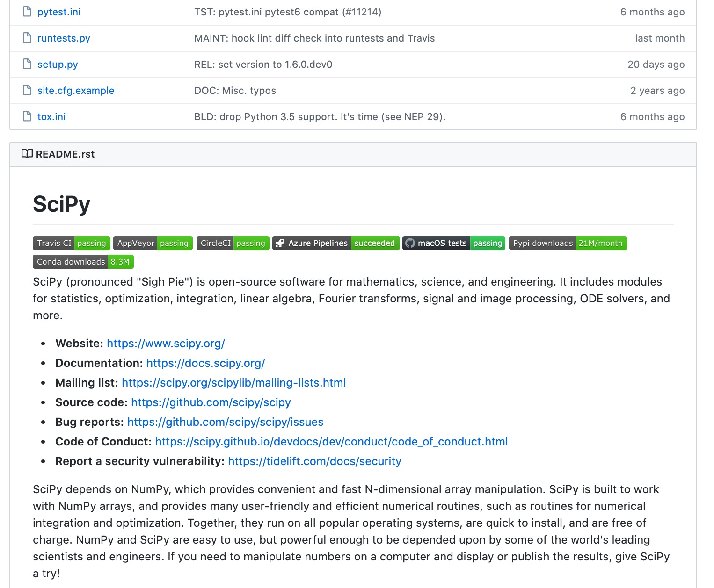

turboPy Intern Project Kick-off
===============================

Do you recognize these?
=======================

Now?
====

Performing Research
===================
- Open mind
- Initial idea/revise
- Sell
- Plan
- Budget
- Execute
- Perform
- Collaborate
- Communicate
  - REALLY understand
  - Feedback
  - Spawns new ideas

**And iterate!**

Computer Science/Software Engineering
=====================================
- User perspective/requirements
- Design
- Programming (e.g. Python)
- Version control
- Continuous Integration
- Documentation
- Unit testing
- Integration testing
- Linting
- Package management
