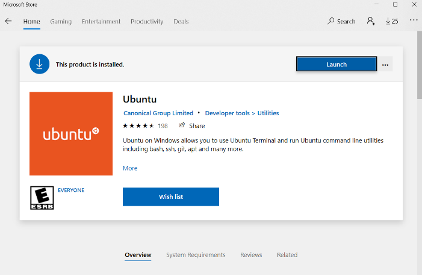
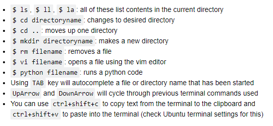
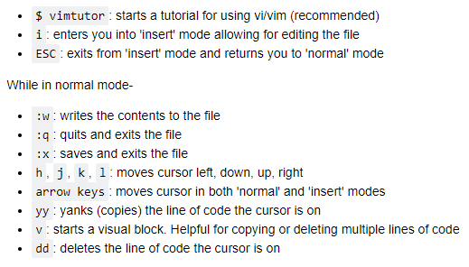
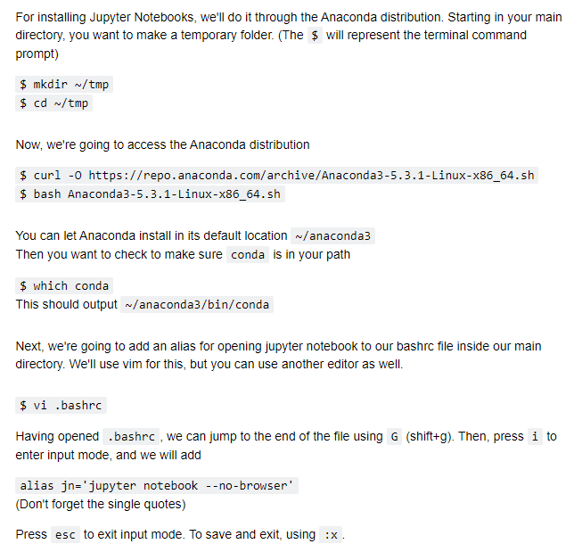
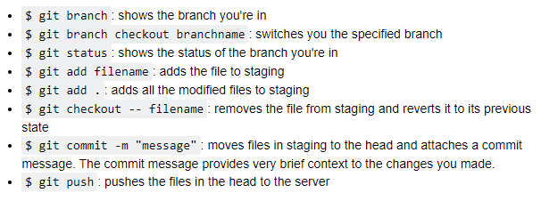
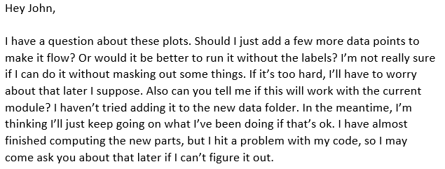
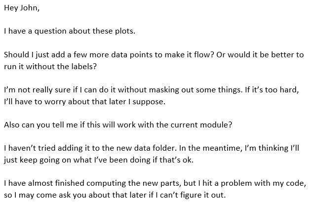

**NOTE: this document contained some content specific to interning at NRL
that has been removed. In its place, we have put notes like this one
describing the type of content that was provided. It was written by
a young staff member who had completed several laboratory internships,
including one at NRL.**

# Intern Tips and Tricks

June 16, 2020

## Introduction

The purpose of this document is to give you some helpful points for the
work you’ll be doing this summer. My hope is that it can provide some
useful foundations that will get you going quickly. I have tried to
present the information at a basic level--enough to get you started if
you don’t have experience with what’s presented, but it’s not an
exhaustive source of information. We expect you to have questions and
will answer them as they come. It also has some advice or “tips” that
I’ve learned over the last few years from my different
research/internship experiences, as well as some extraneous information
about stuff.

### Contents

-   NRL (**removed**)
-   WSL Ubuntu
-   Terminal Commands
-   Vim Editor
-   Python
-   Jupyter Notebooks
-   GitHub
-   Advice and Tips

## NRL

**NOTE: this section contained a few notes about NRL with links to websites
for further info.**

## WSL Ubuntu (for Windows users)

Windows does not have a native terminal for coding like Mac or Linux.
Because of this, if you are working on a Windows machine, you need to
adapt. One option is to add a virtual Linux machine to your computer
through clients like [VirtualBox](https://www.virtualbox.org/) or
[VMWare](https://www.vmware.com/products/workstation-player/workstation-player-evaluation.html).
The other option that Windows offers is a full-fledged, strictly
terminal view, Ubuntu Linux machine through the Microsoft Store (WSL
Ubuntu). It downloads as an app but allows for all the coding needs we have.
There are a few versions based on the Ubuntu operation system edition
(Ubuntu 20.04 LTS, 18.04 LTS as of this writing), but I would use just
[Ubuntu](https://www.microsoft.com/en-us/p/ubuntu/9nblggh4msv6#activetab=pivot:overviewtab)
(I think they keep that one updated). You may have to enable Windows
Subsystem before installing the WSL Ubuntu: [Windows Subsystem for
Linux](https://docs.microsoft.com/en-us/windows/wsl/install-win10?redirectedfrom=MSDN)

Using the WSL Ubuntu is beneficial because you don’t have to worry about
adding a virtual machine through a client (which isn’t necessarily hard
but takes extra time and effort), and it’s very clean and
straight-forward. WSL Ubuntu integrates easily with Python, GitHub, and
Jupyter Notebooks since it’s still a Linux box. You can access the files
on the Ubuntu machine through the normal Windows file explorer AND you
can modify the Linux files from the Windows side (Windows 10 updated 
greater than 1903). A normal install will place the Ubuntu folder in
C:\\Users\\yourusername\\AppData\\Local\\Packages\\CanonicalGroupLimited.UbuntuonWindows\[…\]\\LocalState\\rootfs\\home.
However, the easiest way to access the Linux machine
is to use `$explorer.exe .` (The `.` at the end opens current location). 
**Note:** AppData is a ‘hidden’ folder.

When you first install it, you’ll have to
create a username and password. The username can be anything, but I
recommend using your first initial and last name (i.e. *flastname*) or
something similar.

For passwords, Linux does not show any indication of characters when you
type, so be mindful of that. The only time I really ever use the
password of this Linux is if I need to use a *sudo* command, which
doesn’t happen that often.

## Terminal Commands

If you’ve never used a terminal window
before, it can feel weird and a bit daunting, but it’s pretty cool. To
me, it certainly feels much more like true coding than when using an
IDE. Here are some links to some tutorial pages if using Linux (Mac is
pretty much identical): [Ubuntu
Tutorial](https://ubuntu.com/tutorials/command-line-for-beginners#1-overview)
and [How to start using the Linux
Terminal](https://www.howtogeek.com/140679/beginner-geek-how-to-start-using-the-linux-terminal/).
There’s plenty of videos you can watch and cheat sheets you can
download. I would recommend watching one or two if you haven’t used a
terminal before. Some of the basic starter commands are listed in the
figure.

## Vim Editor

Vim is a text editor in the terminal.
(The original version is Vi. Vim is the “modified” Vi.) There are plenty
of other editors, and each have devoted ‘fans’. The main ones
that have been around for a while are Emacs, Vi/Vim, and Nano. Nano is
very basic, whereas Emacs and Vi have more of a learning curve. It can
be worth trying out the different editors to find one you like. I used
Nano for a long time, but recently switched to Vim. There are a lot of 
different commands, and it can be helpful to get a cheat sheet.
Some of the basics are listed in the figure.

## Python

Python is a computer language widely used in all sorts of different
industries. It is powerful and yet fairly simple and flexible. It can
become complex, which is part of what makes it so attractive to users.
There are vast amounts of packages that can be added/imported to a
Python code to make it better for whatever the user is trying to
accomplish. For scientific computing, some of the more widely used are
`numpy`, `scipy`, `pandas`, and `matplotlib.pyplot`. I also like using `csv`
when I need to import data from files.

We will be using 
[RealPython.com](https://realpython.com/) extensively during the internship,
so be sure to join the Branch Team on that site. It has tons of Python
learning content in both article and video forms. The training plan and 
execution will be managed through this repository (see the README) via issues,
project cards, and markdown files.
The “training plan” includes many learning paths and individual
lessons on the site such as: [Introduction to
Python](https://realpython.com/learning-paths/python3-introduction/),
[Object-Oriented Programming with
Python](https://realpython.com/learning-paths/object-oriented-programming-oop-python/),
and [Testing Your Python
Apps](https://realpython.com/learning-paths/test-your-python-apps/).
There are plenty of tutorials ranging from big picture to small
individual functions. RealPython is a great resource that I will also be
using this summer as all of my Python “skills” have been self-taught.
There’s always more to learn in Python, and so many ways to improve your
coding style. Taking a half-hour to an hour a day to read/watch a
tutorial is worth it. It may not benefit you that day, but it will
eventually.

Most of what you’ll probably do will rely heavily on the basics, so
learning the syntax early on is key. However, googling is also often
times your best friend. Problems you’ll run into have likely been posted
to sites like StackExchange and solved by other users. While it may not
be exactly what your issue is, there’s probably something very close to
it. It’s a good idea to utilize these kinds of resources to get your
code to work and troubleshoot.

## Jupyter Notebooks

[Jupyter Notebooks](https://jupyter.org/) is a great tool that allows
for simultaneous coding and markdowns. It installs into your machine and
when run, creates a browser-based “interactive development environment”
where you can do everything. One of the really nice qualities is its
immediate visualization ability, whether that’s plotting or checking variable
outputs. We mainly use it with Python, but there are other languages that
can be used with it.

 

RealPython has a great tutorial on using Jupyter Notebooks which you
should watch (Jupyter Notebook Tutorial). There are some nice shortcuts
that you can use when creating a notebook. The above tutorial
mentions a few. When installing it onto your Mac/Linux from the
terminal, you can follow the steps given in the figure.

Fun fact: The figures in this document with commands were created in a 
Jupyter Notebook.

## GitHub

[GitHub](https://github.com/) and
[GitLab](https://about.gitlab.com/) are online/server-based
collaborating tools which allow for software development projects to be
accessed and worked on by numerous people. They are integrated with
version control, meaning that changes and modifications are tracked.
Users can go back through older versions which is useful in cases where
a change may actually create a problem in a project. You’ll be using
GitHub this summer for your projects. Some useful commands to use in the
terminal when using GitHub or GitLab are listed in the figure.

## Advice and Tips

The whole point of an internship is to gain experience and learn things.
Nobody expects you to know everything (or honestly much at all), so ask
questions. If you were expected to have all the answers, you wouldn’t be
interning. The goal is to teach you some things, get you interested in
the work we do, and maybe get something productive out of your time. We
certainly want you to leave feeling like it was worth it.

Also, seriously do not feel bad if you don’t know what someone else is
talking about. 
Even the PhDs who have been
working for 30 years don’t know everything. When on a call with others or 
listening to a seminar, there are instances where you just nod and have to
go look it up later. But when actively talking to people, it’s better to 
say “I don’t know.” Certainly, do not ever try to bluff your way through
something. That’ll just make you look really bad.

### Problem Solving

While it’s noble to try to solve every problem on your own, don’t spend
too much time on this. There’s a balance between self-reliance and
productivity. Some examples: A coding syntax issue should be Googled
pretty much right away. A “why isn’t this working” or “how should I
construct this” issue, I think, should be pondered and worked through
for only a few hours by yourself. If you’re still stuck after 2-3 hours,
then ask someone for their thoughts. There's no logic in spending 8 hours on the
same problem.

Learning to find out the information you need takes time. Lots of times,
I didn’t know enough to even formulate the question that would help me
learn what I was trying to figure out. That’s ok. I still dealt with
that my second internship, and still even now. Do your best to “follow 
the breadcrumbs” when looking things up or when trying to learn something new.

**NOTE: some NRL-specific content about computing was removed.**

### Emails

If you haven’t already, you should add a
signature line to your email. This should have your name, email address,
and possibly phone number (depending on how you feel about giving out
your cell). There will be a lot of email traffic this summer because teleworking,
so it’s very helpful for others to have your contact information easily
accessible on the email. The signature also speeds up the process since
you don’t have to type everything out each time.

One of the (many) things I learned last summer was improving the structure 
of my emails. Instead of writing a long paragraph filled with all of the things I
wanted to ask and say, it’s better to break up the email. If asking a
question, separate that on a newline so that it stands out. If you’re
going to talk about more than a single thing, start a new section, even
if the first one was only a couple sentences. Of course, be courteous
and respectful in your emails, but you don’t have to be ultra-formal.
You’re not writing an essay so it doesn’t have to flow like one.

#### A poorly structured email:

#### A better email:

### Being Nervous

It's ok to be nervous especially in a meeting or going to present something.
I get nervous when I go to present something, so it's fine if you do, too.
Everyone in the branch is really cool and understanding, so please, if you
have something you want to say during a meeting, go for it! Also don't
be intimidated by anyone in the branch. (I refer back to the "really cool
and understanding.")

